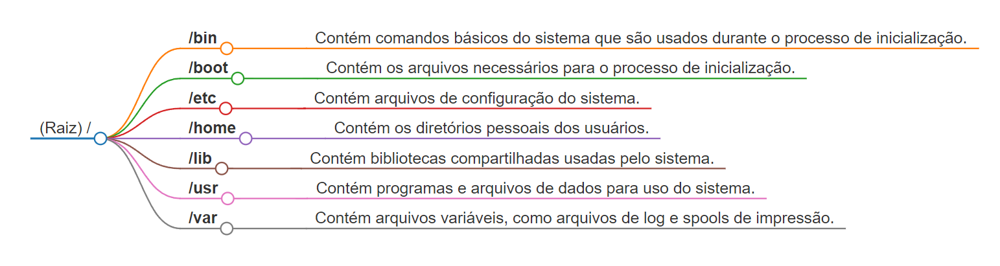
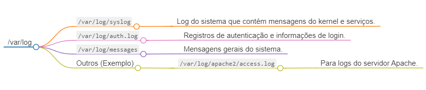

# **Estudos Linux**
Essa documentação tem o objetivo de ser uma referência para a administração do sistema operacional linux, fazendo um compilado de vários tópicos importantes para executarmos nossas tarefas no dia a dia.

## **Tópicos**
- Estruturas dos Diretórios
- Controle de logs
- Manipulando arquivos e Diretórios
- Consultando arquivos e Diretórios (Avançado)
- Instalação e remoção de pacotes
- Trabalhando com serviços
- Consultando recursos do sistema operacional
- IAM (Permissões/Usuários/Grupos)
- Variáveis de Ambiente
- Particionamento de Disco
- Acesso SSH
- Lista de Comandos Essenciais para DevOps

### **Estruturas dos Diretórios**


### **Controle de logs**
O controle de logs no Linux é fundamental para monitorar e diagnosticar o sistema operacional e os aplicativos em execução. Nesta tópico serão abordados os conceitos fundamentais do controle de logs no Linux, incluindo os tipos de logs, onde eles são armazenados, como visualizá-los e gerenciá-los.

#### **Conceitos Básicos**

1. **Tipos de Logs**<br>
Existem vários tipos de logs no Linux, incluindo:
    - **Syslog**: Logs do sistema que abrangem eventos do kernel, serviços e aplicativos.
    - **Logs de aplicativos**: Logs gerados por aplicativos específicos, como servidores web, bancos de dados, e-mails, etc.
    - **Logs de segurança**: Registros de atividades de segurança, como tentativas de login, alterações de permissões, etc.
    - **Logs de autenticação**: Informações sobre autenticação de usuários.
    - **Logs do sistema**: Mensagens do kernel, eventos de hardware, etc.

2. **Localização dos Arquivos de Log**<br>
<br>
Os arquivos de log geralmente estão localizados no diretório `/var/log`. Os principais arquivos de log incluem:
    - `/var/log/syslog`
        - Log do sistema que contém mensagens do kernel e serviços.
    - `/var/log/auth.log`
        - Registros de autenticação e informações de login.
    - `/var/log/messages`
        - Mensagens gerais do sistema.
    - Outros (Exemplo)
        - Outros arquivos específicos de aplicativos ou serviços
            - `/var/log/apache2/access.log`
                - Para logs do servidor Apache.

#### **Comandos e Ferramentas**

1. **Visualização de Logs**
    - `cat` ou `less`: Exibir o conteúdo completo de um arquivo de log.<br>
        ```bash
        cat /var/log/syslog
        ```
    - `tail`: Exibir as últimas linhas de um arquivo de log (útil para logs em tempo real).<br>
        ```bash
        tail -f /var/log/syslog
        ```
2. **Filtragem e Análise de Logs**
    - `grep`: Filtrar linhas que correspondam a um padrão específico.<br>
        ```bash
        grep "Failed password" /var/log/auth.log
        ```
    - `awk`: Manipular e analisar dados em logs.<br>
        ```bash
        awk '{print $1, $5, $6}' /var/log/apache2/access.log
        ```

#### **Ferramentas Avançadas**

1. **journalctl**<br>
O `journalctl` é uma ferramenta para acessar os logs do sistema gerenciados pelo `systemd`.
    - Exibir logs do sistema:<br>
        ```bash
        journalctl
        ```
    - Filtrar logs por unidade de serviço:<br>
        ```bash
        journalctl -u nginx.service
        ```
2. **Configuração de Rotação de Logs**<br>
O Linux utiliza o `logrotate` para gerenciar e rotacionar os arquivos de log para evitar que eles cresçam indefinidamente.`
    - Arquivo de configuração: `/etc/logrotate.conf` e arquivos de configuração específicos em `/etc/logrotate.d/`.

#### **Gerenciamento de Logs em Ambientes de Produção**
- **Centralização de Logs**:<br>
    Usar ferramentas como Elasticsearch, Logstash e Kibana (ELK Stack) para coletar, armazenar e analisar logs de vários servidores.
- **Monitoramento de Logs em Tempo Real**:<br> 
    Configurar alertas para eventos importantes usando ferramentas como `syslog-ng`, `rsyslog`, ou soluções de monitoramento como Prometheus com Grafana.

### Manipulando arquivos e Diretórios
1. **Manipulando pastas**
    - `mkdir`<br>
        - Comando de criação básico:<br>
            ```bash
            mkdir folder1
            ```
        - Criando as pastas recursivamente:<br>
            ```bash
            mkdir -p folder1\subfolder1
            ```
        - Criando as pastas recursivamente e aplicando permissões<br>
            ```bash
            mkdir -m 775 -p folder1\subfolder1
            ```
    - `rm`<br>
        - No cenário de folders o rm deve ser utilizado para folders que não estão vazios.<br>
        - Comando para excluir uma pasta:<br>
            ```bash
            rm folder1
            ```
        - Excluindo uma pasta de forma recursiva:<br>
            ```bash
            rm -rf folder1
            ```
    - `rmdir`<br>
        - Utilizado para deletar folder vazios.<br>
        - Deletando o dir:<br>
            ```bash
            rmdir meu_diretorio_vazio
            ```

### Consultando arquivos e Diretórios (Avançado)
1. **Pesquisando qualquer file com determinado conteúdo**
    - No diretório / pesquisar qualquer arquivo com "teste*" recursivamente:<br>
        ```bash
        sudo find / -type f -name "test*"
        ```
    - No diretório / pesquisar qualquer folder com "teste*" recursivamente:<br>
        ```bash
        sudo find / -type d -name "test*"
        ```
    - Join com as duas funções anteriores:<br>
        ```bash
        sudo find / -type f,d -name "test*"
        ```

2. **Utilizando o comando grep para pesquisar o conteúdo do arquivo**
    - No diretório / pesquisar qualquer arquivo com o conteúdo "exemplo" recursivamente:<br>
        ```bash
        sudo find / -type f -exec grep -l "exemplo" {} +
        ```

### Instalação e remoção de pacotes
1. **Atualizando o repositório**<br>
    ```bash
    sudo apt update
    ```
2. **Pesquisando o pacote no repositório**<br>
    ```bash
    sudo apt search openjdk-17-jdk
    ```
3. **Instalando o pacote**<br>
    ```bash
    sudo apt-get install openjdk-17-jdk -y
    ```
4. **Removendo um pacote**
    - **Removação simples:**<br>
        ```bash
        sudo apt-get remove openjdk-17-jdk
        ```
    - **Removendo o pacote, seus arquivos e depências:**<br>
        ```bash
        sudo apt-get autoremove openjdk-17-jdk
        ```

### Trabalhando com serviços
1. **Comandos básicos**<br>
    - Verificar status do serviço:<br>
        ```bash
        sudo systemctl status meu_servico
        ```
    - Parando o serviço:<br>
        ```bash
        sudo systemctl stop meu_servico
        ```
    - Iniciando o serviço:<br>
        ```bash
        sudo systemctl start meu_servico
        ```
    - Habilitando o serviço para início automático:<br>
        ```bash
        sudo systemctl enable meu_servico
        ```
    - Desabilitando o início automático do serviço:<br>
        ```bash
        sudo systemctl disable meu_servico
        ```
    - Buscando um serviço:<br>
        ```bash
        ps aux | grep meu_servico
        ```

2. **Criando Serviço Personalizado**<br>
    - Criando um script personalizado:<br>
        Primeiro, crie o script que você deseja executar como parte do serviço. Por exemplo, vamos criar um script simples chamado `meu_script.sh` que imprime uma mensagem no terminal:
        ```bash
        #!/bin/bash
        echo "Hello from meu_script.sh"
        ```
        Salve este script em um local acessível, por exemplo, em `/opt/meu_script.sh`, e torne-o executável:<br>
        ```bash
        chmod +x /opt/meu_script.sh
        ```
    - Criando o Arquivo de Serviço do systemd:<br>
    Agora, crie um arquivo de serviço do systemd para o seu script. Vamos chamá-lo de `meu_servico.service`. Use um editor de texto para criar este arquivo (por exemplo, `sudo vi /etc/systemd/system/meu_servico.service`) e adicione o seguinte conteúdo:<br>
        ```bash
        [Unit]
        Description=Meu Serviço Executando meu_script.sh
        After=network.target

        [Service]
        Type=simple
        ExecStart=/opt/meu_script.sh
        Restart=always

        [Install]
        WantedBy=multi-user.target
        ```
        - **`Description`**: Descrição do serviço.
        - **`After`**: Especifica que o serviço deve ser iniciado após a conclusão da inicialização da rede.
        - **`Type`**: Define o tipo de serviço. Neste caso, `simple` é usado para scripts que não requerem uma estrutura de daemon.
        - **`ExecStart`**: Caminho para o script a ser executado.
        - **`Restart`**: Define o comportamento de reinicialização do serviço em caso de falha.
        - **`WantedBy`**: Especifica o alvo multiusuário como alvo para habilitar o serviço.
    - Habilitar e Iniciar o Serviço:<br>
        Depois de criar o arquivo de serviço, recarregue as unidades do systemd para reconhecer o novo serviço:<br>
        ```bash
        sudo systemctl daemon-reload
        ```   
        Agora, você pode habilitar o serviço para que ele inicie automaticamente durante o inicializar do sistema e iniciar o serviço:<br>
        ```bash
        sudo systemctl enable meu_servico
        sudo systemctl start meu_servico
        ```
    - Verificar o Status do Serviço:<br>
        Você pode verificar o status do serviço para garantir que está em execução sem erros:<br>
        ```bash
        sudo systemctl status meu_servico
        ```
        Se tudo estiver configurado corretamente, você verá a saída indicando que o serviço está ativo e em execução.<br>
    - Testar o Serviço:<br>
        Para testar o serviço, verifique se o script está sendo executado conforme esperado:<br>
        ```bash
        journalctl -u meu_servico
        ```

3. **Deletando um Serviço**<br>
Para apagar um serviço que você criou usando o systemd, você pode seguir os seguintes passos para desabilitar e remover o serviço:<br>
    - Parar o Serviço<br>
        Antes de remover o serviço, pare-o para garantir que ele não esteja em execução:<br>
        ```bash
        sudo systemctl stop meu_servico
        ```
    - Desabilitar o Serviço<br>
        Desabilite o serviço para que ele não seja iniciado automaticamente durante o próximo inicializar do sistema:<br>
        ```bash
        sudo systemctl disable meu_servico
        ```
    - Remover o Arquivo de Serviço<br>
        Remova o arquivo de serviço do systemd que define o seu serviço:<br>
        ```bash
        sudo rm /etc/systemd/system/meu_servico.service
        ```
    - Recarregar as Unidades do systemd<br>
        Após remover o arquivo de serviço, recarregue as unidades do systemd para atualizar as configurações:<br>
        ```bash
        sudo systemctl daemon-reload
        ```
    - Limpar Registros do Serviço (Opcional)<br>
        Se desejar, você pode limpar os registros associados ao serviço do sistema de log do systemd:<br>
        ```bash
        sudo journalctl --vacuum-time=1d
        ```
        Isso irá limpar os registros do systemd mais antigos que tenham mais de um dia.<br>

### Consultando recursos do sistema operacional

1. **Informações Gerais do Sistema**
    - **`uname -a`**: Exibe informações do kernel e do sistema operacional.
    - **`hostname`**: Mostra o nome do host do sistema.
    - **`uptime`**: Mostra há quanto tempo o sistema está funcionando e a carga média.

2. **Informações de CPU**
    - **`lscpu`**: Lista informações detalhadas sobre a CPU.
    - **`cat /proc/cpuinfo`**: Exibe informações sobre os núcleos da CPU.
    - **`top` ou `htop`**: Monitora a utilização da CPU em tempo real.

3. **Informações de Memória**
    - **`free -h`**: Mostra o uso atual de memória, incluindo RAM e swap.
    - **`vmstat`**: Exibe estatísticas de memória virtual.
    - **`htop`**: Mostra informações de uso da memória de forma interativa.

4. **Informações de Disco**
    - **`df -h`**: Exibe o uso de espaço em disco de todas as partições.
    - **`du -h`**: Mostra o uso de espaço em disco de diretórios específicos.
    - **`lsblk`**: Lista informações sobre dispositivos de bloco (discos e partições).

5. **Informações de Rede**
    - **`ifconfig` ou `ip a`**: Mostra informações sobre interfaces de rede.
    - **`netstat -tunlp`**: Lista conexões de rede e portas abertas.
    - **`ping`**: Testa a conectividade de rede com um host.

6. **Processos e Utilização da CPU**
    - **`ps aux`**: Lista todos os processos em execução.
    - **`top` ou `htop`**: Mostra os processos em execução e sua utilização de CPU.
    - **`pidstat`**: Exibe estatísticas detalhadas sobre a utilização da CPU por processo.

7. **Logs do Sistema**
    - **`journalctl`**: Mostra mensagens de log do sistema (especialmente útil em sistemas com `systemd`).
    - **`dmesg`**: Exibe mensagens do kernel.

8. **Informações de Hardware**
    - **`lshw`**: Lista informações detalhadas sobre o hardware.
    - **`lsusb`**: Mostra dispositivos USB conectados.
    - **`lspci`**: Exibe dispositivos PCI conectados.

9. **Monitoramento de Desempenho em Tempo Real**
    - **`top`**: Monitora recursos do sistema em tempo real.
    - **`htop`**: Uma alternativa interativa ao `top` com mais recursos.
    - **`iotop`**: Mostra o uso de E/S por processos.

10. **Verificação de Temperatura**
    - **`sensors`**: Exibe informações sobre sensores de temperatura do hardware.

### IAM (Permissões/Usuários/Grupos)

1. **Gerenciamento de Usuários e Grupos**
    - Criar um Novo Usuário:<br>
        ```bash
        sudo adduser novo_usuario
        ```
        Isso criará um novo usuário e solicitará a definição de uma senha.
    - Criar um Novo Grupo:<br>
        ```bash
        sudo groupadd novo_grupo
        ```
        Isso cria um novo grupo no sistema.<br>
    - Adicionar Usuário a um Grupo Existente:<br>
        ```bash
        sudo usermod -aG nome_grupo nome_usuario
        ```
        Isso adiciona o usuário especificado ao grupo especificado.<br>
    - Remover Usuário de um Grupo:<br>
        ```bash
        sudo deluser nome_usuario nome_grupo
        ```
        Isso remove o usuário especificado do grupo especificado.<br>
    - Listar Grupos de um Usuário:<br>
        ```bash
        groups nome_usuario
        ```
        Isso lista todos os grupos aos quais o usuário especificado pertence.<br>
    - Alterar Grupo Principal de um Usuário:<br>
        ```bash
        sudo usermod -g novo_grupo nome_usuario
        ```
        Isso altera o grupo principal do usuário para o grupo especificado.<br>

2. **Controle de Permissões e Modificação de Atributos**

- Permissões de Arquivos (chmod):<br>
    - **chmod**: Altera as permissões de acesso de arquivos ou diretórios.<br>
        Exemplo: Dar permissão de leitura, gravação e execução para o proprietário, e permissão de leitura e execução para grupo e outros.<br>
        ```bash
        chmod 755 arquivo
        ```

    - **chmod +x**: Adiciona permissão de execução ao arquivo.<br>
        Exemplo: Dar permissão de execução para todos os usuários.<br>
        ```bash
        chmod +x script.sh
        ```

    - **chmod g+s**: Define o bit setgid no diretório, fazendo com que os arquivos criados dentro dele herdem o grupo do diretório.<br>
        Exemplo:<br>
        ```bash
        chmod g+s diretorio
        ```

- Atributos de Arquivos (chattr):
    - **chattr**: Modifica os atributos de um arquivo ou diretório.<br>
        Exemplo: Tornar um arquivo imutável (não pode ser modificado, renomeado ou excluído).<br>
        ```bash
        chattr +i arquivo
        ```
        Para remover o atributo:<br>
        ```bash
        chattr -i arquivo
        ```

### Variáveis de Ambiente

#### O que são Variáveis de Ambiente?
Variáveis de ambiente são variáveis dinâmicas que contêm informações sobre o ambiente de execução de um processo ou usuário no sistema operacional. Elas armazenam dados como diretórios de busca para executáveis, configurações padrão para aplicativos, configurações de idioma, e outras informações de contexto.

1. **Principais Variáveis de Ambiente no Linux**

    - **`PATH`**: Esta é uma das variáveis mais importantes. Ela define os diretórios nos quais o sistema procura por programas executáveis. Quando você digita um comando no terminal, o sistema verifica os diretórios listados na variável `PATH` para encontrar o executável correspondente.
    Exemplo:<br>
        ```bash
        echo $PATH
        ```
    - **`HOME`**: Esta variável contém o caminho para o diretório pessoal do usuário. Exemplo:<br>
        ```bash
        echo $HOME
        ```
    - **`USER`** ou **`USERNAME`**: Estas variáveis contêm o nome do usuário atualmente logado no sistema. Exemplo:<br>
        ```bash
        echo $USER
        ```
    - **`LANG`** ou **`LC_*`**: Estas variáveis controlam as configurações de localização e idioma do sistema. Exemplo:<br>
        ```bash
        echo $LANG
        ```

2. **Visualizando e Definindo Variáveis de Ambiente**

    - **Visualizando uma Variável de Ambiente**:
        ```bash
        echo $NOME_DA_VARIAVEL
        ```
    - **Definindo uma Variável de Ambiente**:
        ```bash
        export NOME_DA_VARIAVEL="valor"
        ```
    - **Removendo uma Variável de Ambiente**:
        ```bash
        unset NOME_DA_VARIAVEL
        ```

3. **Exemplos Práticos**

    - Exemplo 1: Utilizando Variáveis de Ambiente<br>
        Suponha que você deseja adicionar um novo diretório ao `PATH` para que o sistema reconheça novos comandos. Você pode fazer o seguinte:<br>
        ```bash
        export PATH=$PATH:/caminho/do/novo/diretorio
        ```
    - Exemplo 2: Acessando Variáveis de Ambiente em um Script<br>
        Você pode usar variáveis de ambiente em scripts Bash para acessar configurações globais ou passar parâmetros para os scripts. Por exemplo:
        ```bash
        #!/bin/bash

        echo "Olá, $USER! Bem-vindo ao sistema."
        echo "Seu diretório pessoal é: $HOME"
        ```

### Particionamento de Disco

#### **Objetivos do Particionamento**
O particionamento de disco tem vários objetivos principais:
1. **Isolamento de Dados**: Partições separadas ajudam a isolar dados críticos de sistema operacional e aplicativos.
2. **Melhor Gerenciamento de Armazenamento**: Facilita o gerenciamento e a manutenção de dados.
3. **Melhor Desempenho**: Melhora o desempenho do sistema ao distribuir cargas de leitura/gravação.
4. **Segurança**: Melhora a segurança ao separar dados confidenciais de dados públicos.
5. **Backup e Recuperação**: Facilita o backup e a restauração de partições individuais.

#### **Tipos de Partições**
Existem vários tipos de partições que podem ser criadas em um disco:
1. **Partição Primária**: A primeira partição em um disco MBR (Master Boot Record). Um disco MBR pode ter até 4 partições primárias.
2. **Partição Estendida**: Uma partição especial que pode conter partições lógicas adicionais. Permite criar mais de 4 partições em um disco MBR.
3. **Partição Lógica**: Partições dentro de uma partição estendida. São usadas para contornar o limite de 4 partições primárias em discos MBR.
4. **Partição de Sistema**: Contém o sistema operacional e arquivos de inicialização.
5. **Partição de Dados**: Armazena dados do usuário, como documentos, fotos, vídeos, etc.
6. **Partição de Swap**: Usada como espaço de troca (swap) para memória virtual.
7. **Partição EFI ou ESP**: Partição usada para armazenar arquivos de inicialização do sistema em discos com sistema de partições GPT (GUID Partition Table).

#### **Configurações Recomendadas para Ambientes de Servidor**

Para um ambiente de servidor, recomenda-se uma estratégia de particionamento que equilibre a separação de dados críticos, sistema operacional e áreas de swap. Aqui está um exemplo geral:

- **Partição `/boot`**: Contém arquivos de inicialização do sistema.
- **Partição `/` (raiz)**: Contém o sistema operacional e aplicativos.
- **Partição `/home`**: Armazena dados de usuários (documentos, configurações, etc.).
- **Partição de Swap**: Espaço de troca para gerenciamento de memória virtual.
- **Partição `/tmp`**: Armazena arquivos temporários.
- **Partição `/usr`**: Armazena os dados estáticos de usuário.
- **Partição `/var`**: Volume lógico LVM para os dados variáveis.
- **Partição `/srv`**: Volume lógico LVM simulando os dados de um servidor de arquivos.

#### **Exemplo de Estrutura de Particionamento**

Um exemplo prático de particionamento em um servidor Linux pode ser com disco de 60GB (Básico):

- **`/dev/sda1`**: Partição Primária `/boot` (ext4) - 2GB
- **`/dev/sda2`**: Partição Raiz `/` (ext4) - 20 GB
- **`/dev/sda3`**: Partição Lógica `/tmp` (ext4) - 4GB
- **`/dev/sda4`**: Partição Lógica `/usr` (ext4) - 8GB
- **`/dev/sda5`**: Partição `/home` (ext4) - Restante do espaço disponível
- **`/dev/sda6`**: Partição Swap - Tamanho recomendado 4GB (Se o Disco for SSD não utilizar)

#### **Comandos para Particionamento**

Para criar partições no Linux, você pode usar ferramentas como `fdisk`, `parted` ou `gparted` (interface gráfica). Aqui estão alguns comandos comuns:

- **Listar Partições**:
  ```bash
  sudo fdisk -l
  ```

- **Criar Partições com `fdisk`**:
  ```bash
  sudo fdisk /dev/sda
  ```

- **Criar Partições com `parted`**:
  ```bash
  sudo parted /dev/sda
  ```

### Acesso SSH
#### **Conectando via SSH**
```bash
ssh <user>@<ip e/ou host>
# O dispositivo irá solicitar uma confirmação e depois a senha do usuário
```
#### **Desativando/ativando o serviço do SSH**
```bash
sudo systemctl disable --now ssh
sudo systemctl enable --now ssh
```

### Lista de Comandos Essenciais para DevOps


